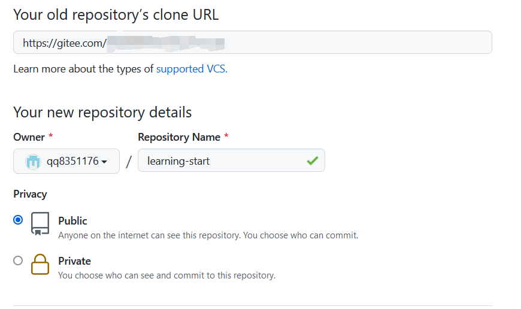
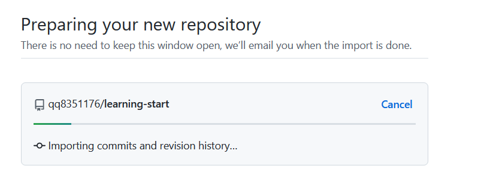
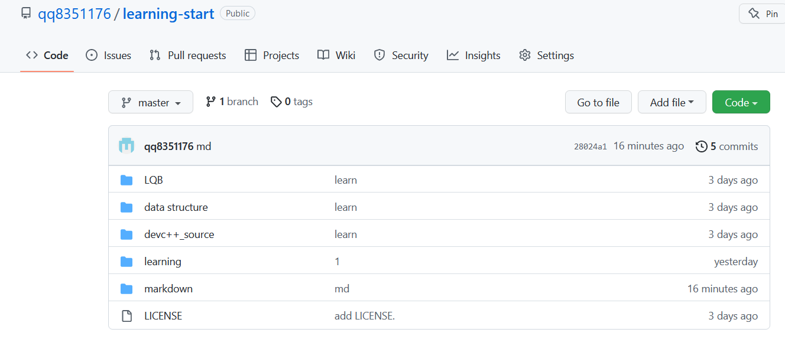

参考文章https://blog.csdn.net/muxuen/article/details/125360459

将已有的gitee导入到github、

首先new一个新的仓库

然后导入仓库

点击蓝色的 import repository

填好仓库的信息

然后等待

	

等待拷贝完成

打开本地库

删掉原来的 origin关联

git remote -v 

git remote rm origin

git remote add github 地址

git remote add gitee 地址

此时再用

git remote -v 便可以查看到两个关联

如果要推送到 github 便用 git push github master

如果要推送到gitee 便用git push gitee master

